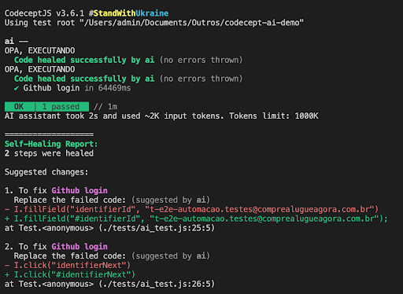
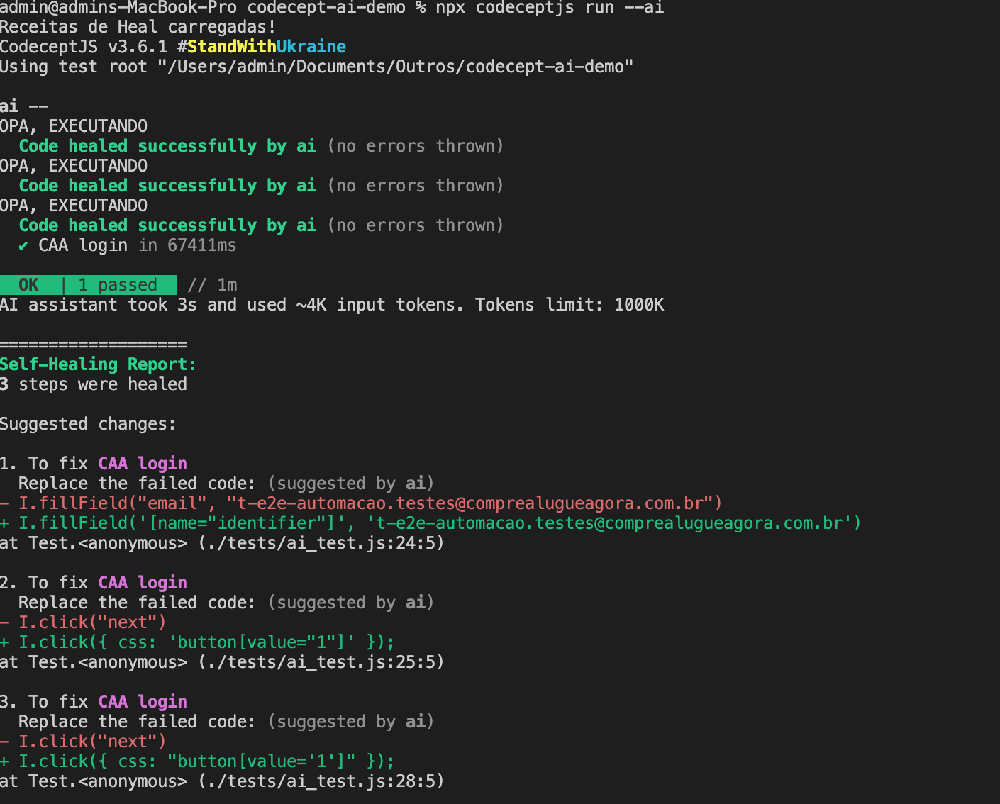

# CodeceptJS AI Demo Login

Este repositório demonstra a aplicação de **self-healing automation** com **Inteligência Artificial** no **CodeceptJS** e **Playwright**.

## 🚀 Instalação

1. Clone este repositório:
   ```sh
   git clone https://github.com/seu-usuario/codeceptjs-ai-demo-login.git
   cd codeceptjs-ai-demo-login
   ```
2. Instale as dependências:
   ```sh
   npm install
   ```
3. Crie um arquivo `.env` e preencha as variáveis conforme o exemplo fornecido em `.env.example`.

## 🧪 Executando testes com IA

Para rodar os testes utilizando **self-healing AI**, utilize um dos comandos abaixo:

Rodando normalmente:
```sh
npx codeceptjs run --ai
```

Rodando com logs detalhados:
```sh
DEBUG="codeceptjs:*" npx codeceptjs run --ai
```

## Testes de Localizadores  

### Teste 1: Removendo Identificadores  
📌 **Objetivo**: Avaliar a capacidade da IA de reconhecer elementos mesmo com a remoção de dois `#` nos localizadores.  
🔍 **Hipótese**: A IA deve conseguir adaptar-se e encontrar os elementos corretamente.  

  

---

### Teste 2: Alteração de Localizadores no Login  
📌 **Objetivo**: Validar a robustez da IA ao utilizar localizadores que diferem significativamente dos originais.  
🔍 **Hipótese**: A IA pode falhar ou exigir um ajuste manual para encontrar os elementos corretos.  

  


---

📌 **Observação:** Certifique-se de que as configurações do CodeceptJS e do Playwright estejam corretas antes de executar os testes.

📖 Para mais informações, consulte a [documentação oficial do CodeceptJS](https://codecept.io/).
